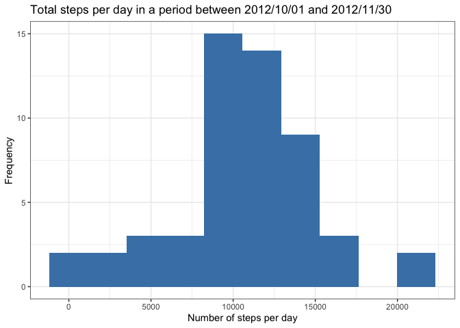
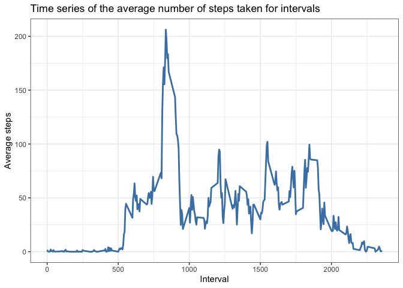
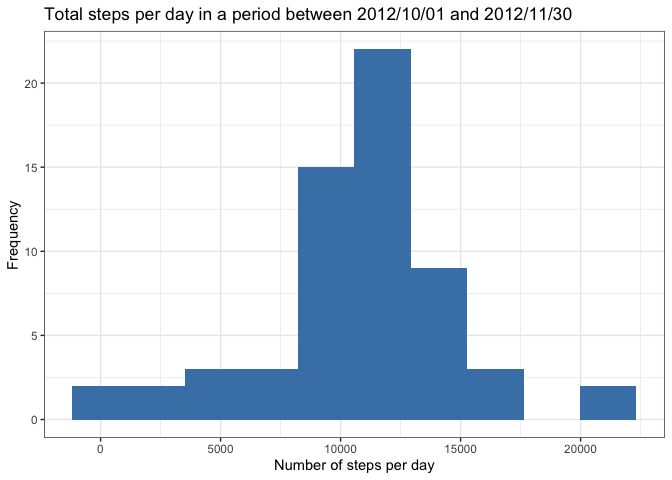
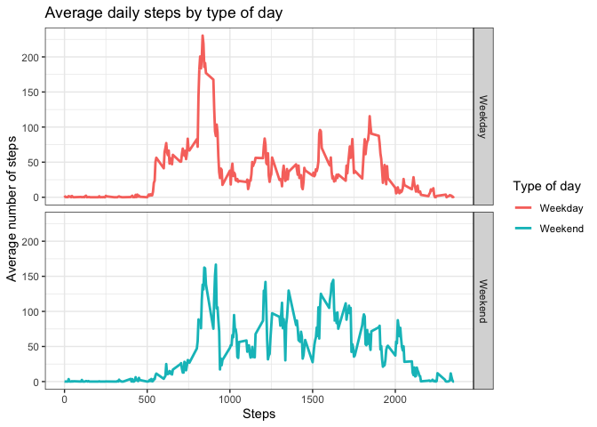

## Loading and preprocessing the data
Firs of all in an analysis we have to load the data and make the necessary changes on it in order to suit well our analysis.


```r
data <- read.csv("/Users/IMAN/Reproducible Research/activity.csv", sep = ",")
```

We can take a look on the first rows of the data.frame so we can see how our data looks like:

```r
str(data)
```

```
## 'data.frame':	17568 obs. of  3 variables:
##  $ steps   : int  NA NA NA NA NA NA NA NA NA NA ...
##  $ date    : Factor w/ 61 levels "2012-10-01","2012-10-02",..: 1 1 1 1 1 1 1 1 1 1 ...
##  $ interval: int  0 5 10 15 20 25 30 35 40 45 ...
```

As we can see, the variable that corresponds to the time is in factor class, so we need to change that to the proper time class so it is more useful for our analysis.

```r
data$date <- as.Date(data$date, "%Y-%m-%d")
```


## What is mean total number of steps taken per day?

In order to ge this part done we have to make a histogram and report the mean and median of those totals.

First of all, in order to calculate the total number of stpes per day I saved in a new data frame the data grouped by day and then summed the steps for that group:

```r
library(dplyr)
datax <- data %>% group_by(date) %>% summarize(steps=sum(steps))
```

The histogram has been built as following, note that NA's are omitted in this code:

```r
library(ggplot2)
ggplot(subset(datax, datax$steps !="NA"), aes(x=steps))+
        geom_histogram(bins = 10, fill="steelblue")+
        theme_bw() +
        labs(x="Number of steps per day", y="Frequency", title ="Total steps per day in a period between 2012/10/01 and 2012/11/30")
```

<!-- -->

To calculate the mean and the median:

```r
mean1 <- mean(datax$steps, na.rm = T)
median1 <- median(datax$steps, na.rm = T)
```

The mean is 1.0766189\times 10^{4} and the median is 10765.


## What is the average daily activity pattern?

First of all we need to average the steps taken per days.

```r
library(dplyr)
datay <- data %>%  group_by(interval) %>%  summarise(steps=mean(steps, na.rm=T)) 
```

To make the time-series plot, note that NA's are omitted in this function:

```r
ggplot2::ggplot(subset(datay, datay$steps != "NA"), aes(x=interval, y=steps))+
        geom_line(color="steelblue", size= 1)+
        theme_bw()+
        labs(x="Interval", y="Average steps", title= "Time series of the average number of steps taken for intervals")
```

<!-- -->

To calculate what day contains the maximum average:

```r
library(dplyr)
max <- datay %>% slice(steps %>% which.max)
interval <- max[,"interval"]
```

The maximum averaged steps per day was in 835 interval.

## Imputing missing values

In order to get the total number of NA's:

```r
totalNA <- sum(is.na(data$steps))
```

The total of NA contained in steps variable is 2304.

In order to fill this NA's I will use the mean of each interval:

```r
library(dplyr)
dataz <- data %>% group_by(interval) %>% summarise(steps=mean(steps, na.rm=T))
```

As we got the mean for each interval, I'll introduce the mean this mean as the step value for each NA value in the new data set.

```r
data1 <- data
imputed_steps <- dataz$steps[match(data1$interval, dataz$interval)]
data1 <- transform(data1, steps = ifelse(is.na(data1$steps), imputed_steps, data1$steps))
```

Now, we can recalculate the histogram of steps taken per day:

```r
library(ggplot2)
data12 <- data1 %>% group_by(date) %>% summarise(steps=sum(steps))
ggplot(data12, aes(x=steps))+
        geom_histogram(bins = 10, fill="steelblue")+
        theme_bw() +
        labs(x="Number of steps per day", y="Frequency", title ="Total steps per day in a period between 2012/10/01 and 2012/11/30")
```

<!-- -->

To calculate the mean and the median:

```r
mean2 <- mean(data12$steps, na.rm = T)
median2 <- median(data12$steps, na.rm = T)
```

The mean in the original data omitting the NA's was 1.0766189\times 10^{4} and the median was 10765.

The mean in the imputated data is 1.0766189\times 10^{4} and the median is 1.0766189\times 10^{4}. 

Only the median has changed, that is to say that the first 50% of days acomulate more steps than did the first 50% of days in the original data (which maskes sense as some observations were omitted due to NA).

## Are there differences in activity patterns between weekdays and weekends?

We were asked to make a panel plot that consissts on two different time series plots of average across weekday days and the other for weekend days.

```r
data1$week <- weekdays(data1$date)
data1$week <- as.factor(ifelse(data1$week %in% c("Saturday", "Sunday"), "Weekend", "Weekday"))
```


```r
x <- aggregate(steps~interval + week, data1, mean, na.rm = TRUE)
```


```r
ggplot2::ggplot(x, aes(x=interval, y=steps, color= week))+
        geom_line(size= 1)+
        theme_bw()+
        labs(x="Steps", y="Average number of steps", title= "Average daily steps by type of day", color= "Type of day") +
        facet_grid(week~.)
```

<!-- -->


